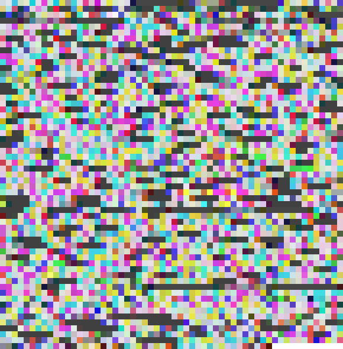

# ColorCode

These are **Python 3.7** scripts to encrypt ASCII text into images.

  * `colorcode.py` encodes ASCII values into an RGB color grid and produces an image
  * `steganography.py`  encodes binary ASCII values across the LSBs of the RGB channels of an existing image

`demo.png` encodes the source code of `colorcode.py` _using_ `colorcode.py`, _and_ the source code of `steganography.py` _using_ `steganography.py`.

Decode this demo image both ways with

```bash
python colorcode.py     --decode --inputfile  demo.png --nrows 59 --ncols 58
python steganography.py --decode --inputimage demo.png
```



## Requirements
Scripts use from the standard library

  * `argparse`
  * `math`
  * `itertools`

as well as `Pillow`, a Python image processing library.

Install on OS X with

```bash
pip install Pillow
conda install Pillow
```

## `colorcode.py`
### Encoding Text
To encode text into a grid of colors:

```bash
python colorcode.py --inputfile   [-]         \
                    --outputfile  [image.png] \
                    --blocksize   [1 1]       \
                    --ncols NCOLS []          \
                    --nrows NROWS []
```
Here,

  * `-i`, `--inputfile`: either `-` for standard input (default) or a text file with the message
  * `-o`, `--outputfile`: name of output file (default: `image.png`)
  * `-b`, `--blocksize`: size of grid blocks in pixels _x_, _y_ (default: 1 &times; 1)
  * Either
    * provide neither of `-nc`, `--ncols` and `-nr`, `--nrows`, in which case the output grid will attempt to be approximately square
    * provide one of them; the other will be computed. If both are given, `--nrows` is ignored

Suggested inputs include

```
  --blocksize 40 40
  --nrows 1
```

The first makes blocks 40 &times; 40 pixels.  
The second makes the image contain exactly one row, useful for names.

### Decoding Images
To decode an image file produced in this way, run the output given by the encoding step:

```bash
python colorcode.py --decode              \
                    --inputfile image.png \
                    --nrows 10            \
                    --ncols 10
```

Here,

  * `-d`, `--decode`: flag indicating that the script run in decode mode
  * `-i`, `--inputfile`: encoded image from the previous step
  * Both `-nr` and `-nc` must be given; otherwise, the script assumes the block size is 1 &times; 1 pixel

## `steganography.py`
### Encoding Text
To encode text into the least significant bits of an existing image,

```bash
python steganography.py --inputimage image.png \
                        --message    [-]
```

Here,

  * `-i`, `--inputimage`: required input image
  * `-m`, `--message`: either `-` for standard input (default) or a text file with the message

A new image is created with a `steg_` prefix.

### Decoding Images
To decode an image file produced this way, run the output produced by the encoding step:

```bash
python steganography.py --decode                   \
                        --inputimage steg_image.png
```

Here,

  * `-d`, `--decode`: flag indicating that the script run in decode mode
  * `-i`, `--inputfile`: encoded image from the previous step

Because of the technical details of this implementation, **two messages may be encoded into the same image**: one with `colorcode.py`, and one with `steganography.py` using the image produced by `colorcode.py`.

## Technical Details
### Overview
`colorcode.py`

  1. takes in a string of characters
  2. multiplies the [ASCII]() value of each character by 2
  3. groups the resulting array of numbers into triplets, filling zeros for any leftovers
  4. interprets each triplet as an RGB color
  5. writes the colors to a .png file

For example, **Dog** has ASCII values **68**, **111**, and **103**, so the corresponding color would be **_RGB_(136,222,206)**, or **hex #88DECE**.

`steganography.py`

  1. takes in an image and a message
  2. turns every character in the message into its 8-bit binary representation
  3. presets the least significant bit (the 1's digit) of every channel of every pixel of the image to 0
  4. sets the least significant bit of every channel _R_, _G_, _B_ (in that order) of each pixel to message bit
  5. writes the transformed image to a new file

For example, the 8-bit ASCII values of **Dog** are **01000100**, **01101111**, and **01100111**, which are correspondingly set into the LSBs of 8 consecutive pixels.

### Why Multiply by 2?
The ASCII values were multiplied by 2 because ASCII characters end at 127, which means that direct RGB values of ASCII characters are rather dark, since they are restricted to the lower half of their spectrum. Conveniently, 127 is less than half of 255, so multiplying by 2 simply shifts the spectrum into the brighter half without overflow.

### Choosing Dimensions and the Number of Colors

For the discussion that follows, let $L$ be the message length.  
Then the number of blocks required is $B = \lceil{L/3}\rceil$.

#### Single row
A single row is an easy and suitable way to represent short strings like names. This is achieved with `--nrows 1`.

#### Explicit specification of rows or columns
One can explicitly choose a number of rows or columns with `--nrows` or `--ncols`.  
Suppose we explicitly choose $n_\text{cols}$.  
Then $n_\text{rows} = \lceil{B / n_\text{cols}}\rceil$.  
Swap rows and columns if $n_\text{rows}$ is explicitly chosen instead. _\

#### Automatic dimensions close to square
For long passages, an image that is close to square looks best.  
The following procedure chooses suitable dimensions.

Consider $n = \lfloor{\sqrt{B}}\rfloor$, and begin with $n_\text{rows} = n_\text{cols} = n$.  
If $n^2 < B$, add a row: $n_\text{rows} \rightarrow n_\text{rows} + 1$.  
If $n_\text{cols} \times n_\text{rows} < B$, add a column: $n_\text{cols} \rightarrow n_\text{cols} + 1$

#### Extra colors and values
When ${L \pmod 3 \not \equiv 0}$, an extra color is required that either has a nonzero value for the _R_ channel only, or for _R_ and _G_ only, with _B_ zero. This last color is therefore usually darker than any of the others.

Unless $n_\text{cols} \times n_\text{rows} = B$, there will be extra squares not corresponding to the message. These extra squares are filled with white.

These extra 0's and 255's do not affect the decoding process. When decoding the message, 0 and 255, floor divided by 2, give 0 and 127, which correspond to `NULL` and `DEL`, neither of which do anything when printed to a screen. Nevertheless, these characters are stripped from the decoded string of characters.

#### Least significant bits
All LSBs are set to 0 initially to prevent junk when decoding. This affects the image slightly, but not enough to distinguishable by eye.

For a message with $M$ characters, there needs to be at least $\lceil{8M/3}\rceil$ pixels in the image.

Once all LSBs are set to zero, the final step is to add 1 to each channel corresponding to a 1 in the binary representation of the message.

#### Combining the two scripts

Since `colorcode.py` multiplies ASCII values by 2, an image produced by it has only RGB values divisible by 2; i.e., their LSBs are all 0. When decoding, the floor division by 2 simply bit-shifts the values to the right, and the LSB is discarded.

Therefore, `steganography.py` does not interfere with images produced by `colorcode.py`, and can be used to encode a second message within the LSBs of the same image file. Decoding the colors is done with `colorcode.py`; decoding the LSBs is done with `steganography.py`.
